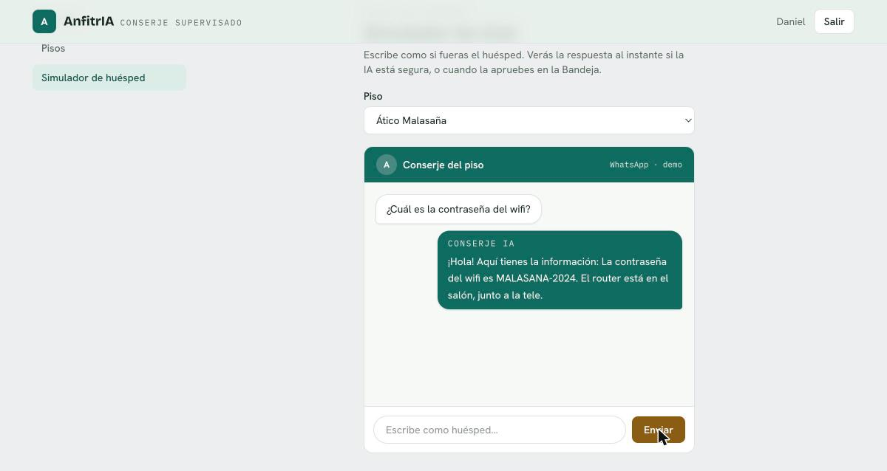
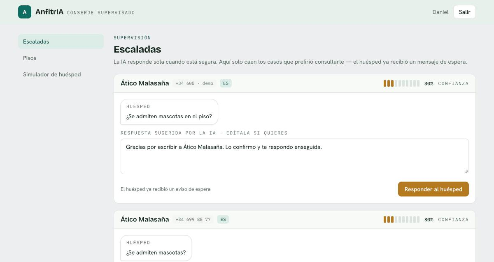
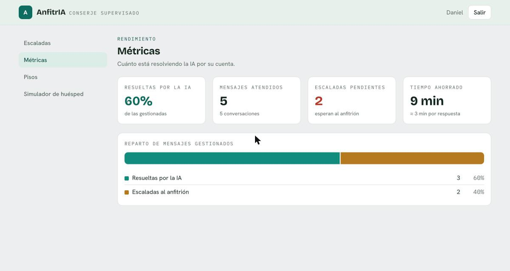
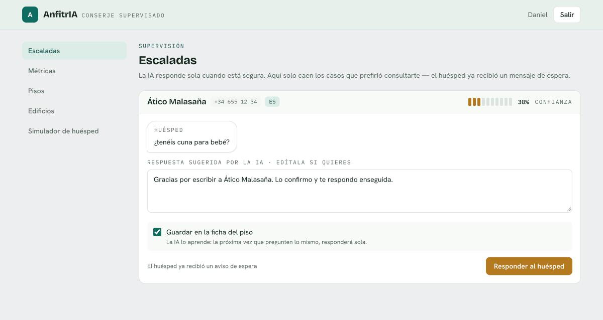
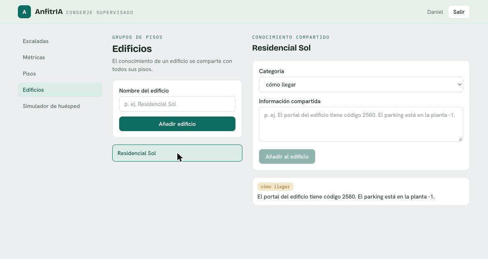
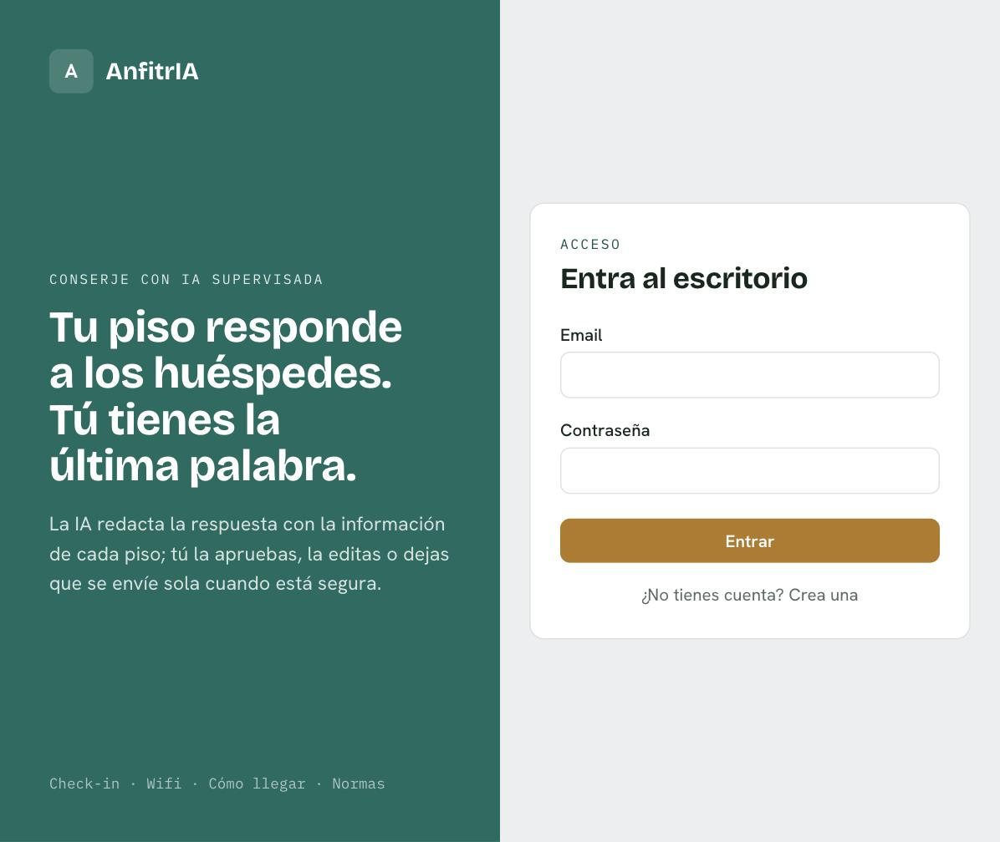
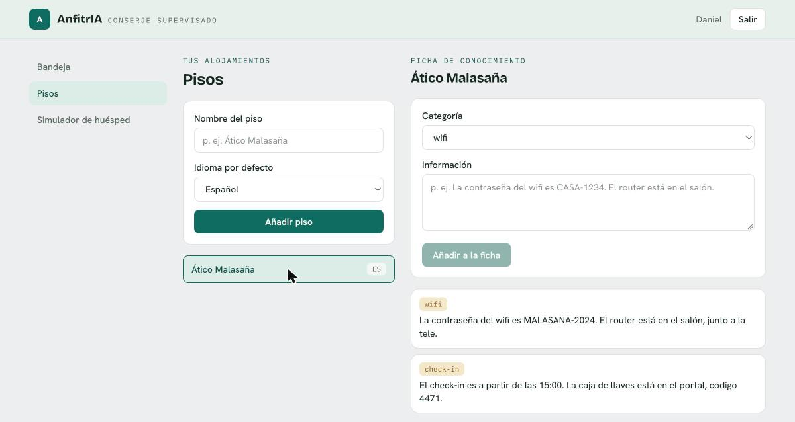

# AnfitrIA 🏨🤖

[](https://github.com/daaniidam/anfitria/actions/workflows/ci.yml)

**Conserje con IA supervisada para alquiler vacacional (Airbnb).** Atiende a los
huéspedes por WhatsApp con respuestas ancladas a la información de cada piso;
el anfitrión **aprueba, edita o envía** desde un panel, con registro de todo.

> Estado: **producto completo (fases 1-7)**. La IA responde sola por WhatsApp
> anclándose en la ficha del piso (RAG + pgvector, o Claude); cuando duda, avisa
> al huésped y **escala** al anfitrión — que puede **guardar su respuesta para que
> la IA la aprenda**. Conocimiento **compartido por edificio**, panel de métricas,
> y todo arranca sin claves ni coste (`mock`/`sim`). Ver el roadmap y las
> [capturas](#interfaz).

## API (Fase 2)
- `POST /auth/register` · `POST /auth/login` · `GET /auth/me`
- `POST /properties` · `GET /properties` · `POST/GET /properties/{id}/knowledge`
- `POST /channels/sim/inbound` — simula un mensaje de huésped → la IA **responde sola** si tiene confianza; si no, envía aviso de espera y **escala**
- `GET /conversations` · `GET /conversations/{id}/messages`
- `GET /inbox` — escaladas pendientes (enriquecidas) · `POST /drafts/{id}/approve` — responder al huésped (con `edited_text` opcional)

Explora todo en `http://localhost:8000/docs`.

## Interfaz

Panel del anfitrión (React + TypeScript + Tailwind) con un **simulador de chat**
de huésped y una pantalla de **escaladas** para supervisión.

**Simulador de huésped** — la IA responde **al instante**; si no sabe algo,
manda un aviso de espera y lo escala (el huésped nunca se queda sin respuesta):



**Escaladas** — solo lo que la IA prefirió consultar; el medidor de confianza
(en latón) indica cuán segura estaba. El anfitrión edita y responde:



**Métricas** — cuánto resuelve la IA sola, escaladas y tiempo ahorrado:



**La IA aprende** — al responder una escalada, el anfitrión puede marcar
*«Guardar en la ficha del piso»*: la próxima vez que pregunten lo mismo,
la IA responde sola:



**Edificios** — agrupa pisos y comparte lo común (cómo llegar, portal,
parking, zonas comunes) con todos ellos de una vez:



| Acceso | Pisos y conocimiento (con modo auto/manual por piso) |
|:---:|:---:|
|  |  |

## Por qué
Los pisos turísticos sin recepción reciben las mismas preguntas una y otra vez
(check-in, wifi, cómo llegar, normas, recomendaciones), hoy por llamada/WhatsApp
del anfitrión. AnfitrIA automatiza esa atención **sin perder el control**: IA
supervisada, multi-idioma (ES/EN) y trazable.

## Stack
- **Backend:** Python 3.12 · FastAPI (async) · SQLAlchemy 2 async · Alembic · Redis + ARQ · uv
- **BD:** PostgreSQL 16 + pgvector (RAG)
- **IA:** adaptador `mock` (sin clave) | `anthropic` (Claude)
- **Canal:** adaptador `sim` (WhatsApp simulado) | `whatsapp_cloud` (Meta Cloud API)
- **Frontend:** React + TypeScript + Vite + TailwindCSS
- **Infra:** Docker Compose (`db`, `redis`, `api`, `worker`, `web`)

## Arranque rápido
```bash
cp .env.example .env          # opcional en fase 1 (los valores por defecto ya sirven)
docker compose up --build
```
- API: http://localhost:8000  ·  Health: http://localhost:8000/health  ·  Docs: http://localhost:8000/docs
- Web: http://localhost:5173

### Sin Docker (solo backend)
```bash
cd backend
uv sync
uv run uvicorn app.main:app --reload    # necesita Postgres/Redis para las fases 2+
uv run pytest                           # tests
uv run ruff check .                     # lint
```

## Estructura
```
anfitria/
├── backend/            # FastAPI + worker ARQ (uv, pyproject.toml)
│   └── app/            # config, main, worker (rutas/modelos/servicios/adaptadores en fases 2+)
├── frontend/           # React + TS (Vite)
├── docker-compose.yml  # db (pgvector), redis, api, worker, web
├── .devcontainer/      # entorno reproducible (VS Code / Codespaces)
├── .cursor/rules/      # contexto del proyecto para Cursor (AI)
└── docs/spec.md        # diseño y decisiones
```

## Roadmap
1. **Andamiaje** — repo, compose, `/health`, React shell, Postgres/Redis. ✅
2. **Núcleo** — auth, pisos, conocimiento, conversaciones, canal `sim`, IA `mock`, aprobación + auditoría. ✅
3. **RAG** — pgvector + embeddings; respuestas ancladas al piso. ✅
4. **Claude real** — adaptador `anthropic` (Claude razona sobre la ficha del piso). ✅
   Actívalo con `AI_PROVIDER=anthropic` + `ANTHROPIC_API_KEY` en un `.env`.
5. **WhatsApp real** — canal Meta Cloud API (envío + webhook con firma HMAC). ✅
   Cómo conectarlo: [`docs/WHATSAPP.md`](docs/WHATSAPP.md).
6. **Métricas + pulido** — panel de métricas del anfitrión (auto-resueltas, escaladas, tiempo ahorrado). ✅
7. **Aprendizaje + edificios** — al responder una escalada, el anfitrión puede guardar la respuesta en la ficha (la IA la aprende para la próxima); y conocimiento **compartido por edificio** entre sus pisos. ✅

## Producción / operación
Además del arranque sin claves, el proyecto está preparado para ir en serio:

- **Migraciones con Alembic** — el esquema se versiona; `create_all` solo se usa
  en desarrollo. Aplica con `cd backend && uv run alembic upgrade head`.
- **Webhook robusto** — verificación + firma HMAC, **idempotencia** (descarta los
  reintentos de Meta por `message id`) y, con `PROCESS_ASYNC=true`, encola la IA
  en el **worker ARQ** y responde a Meta al instante.
- **Seguridad** — sesión en **cookie httpOnly** con *refresh* y revocación
  (logout invalida los tokens), **rate limiting** en login/entrada y límites de
  longitud en las entradas. Prompt de Claude endurecido contra inyección.
- **Panel** — la IA **aprende** de las escaladas, avisa al anfitrión cuando algo
  se escala (campana), registro de **auditoría** consultable y **métricas** con
  tendencia diaria. Conocimiento editable y borrable por piso y por edificio.
- **CI** — GitHub Actions corre `ruff` + `pytest` (backend) y `oxlint` + build +
  `vitest` (frontend) en cada push.

## Continuar en Cursor
Este repo trae **reglas de proyecto en `.cursor/rules/`** para que el agente de
Cursor continúe con todo el contexto (stack, arquitectura, convenciones y fases).
Abre la carpeta en Cursor y pídele, por ejemplo: *"implementa la Fase 2 siguiendo
las reglas del proyecto"*. Empieza por `docs/spec.md`.

## Créditos
Proyecto personal de **Daniel López** ([@daaniidam](https://github.com/daaniidam)).
